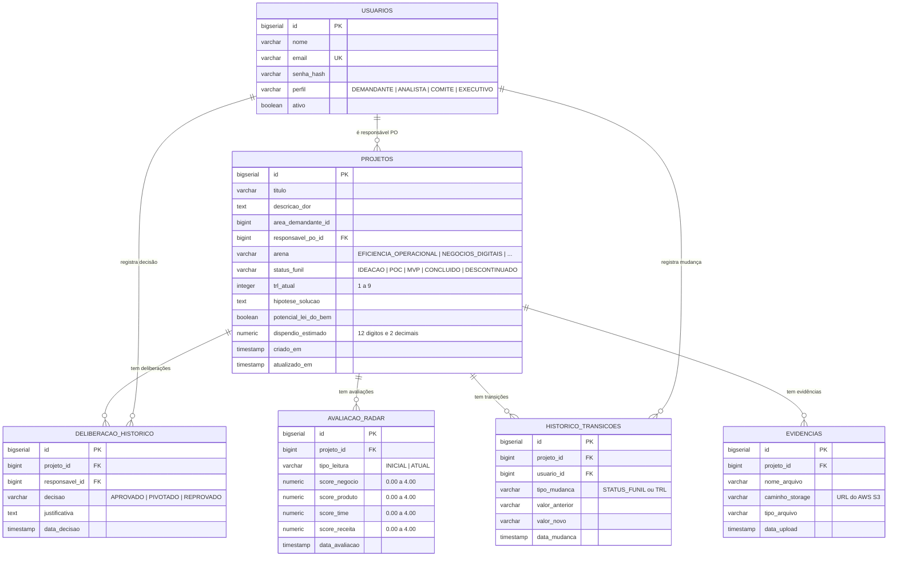

# 📘 SIGES-PIN — Documentação Técnica: Fase 1

**Sistema Corporativo de Gestão do Portfólio de Inovação da BBTS**

> **Data:** 05/10/2026  
> **Versão:** 1.0 — Camada de Domínio (Entidades, Enums, Repositórios e Migration)  
> **Equipe:** Back-end SIGES-PIN

---

## 📑 Índice

1. [Visão Geral do Projeto](#1-visão-geral-do-projeto)
2. [Stack Tecnológica](#2-stack-tecnológica)
3. [Estrutura de Pastas do Código](#3-estrutura-de-pastas-do-código)
4. [Conceitos Fundamentais](#4-conceitos-fundamentais)
   - 4.1 [O que é uma Entidade JPA](#41-o-que-é-uma-entidade-jpa)
   - 4.2 [O que é um Enum](#42-o-que-é-um-enum)
   - 4.3 [O que é um Repository](#43-o-que-é-um-repository)
   - 4.4 [Flyway vs Hibernate — Quem faz o quê?](#44-flyway-vs-hibernate--quem-faz-o-quê)
5. [Configuração da Aplicação](#5-configuração-da-aplicação)
6. [Modelagem de Dados](#6-modelagem-de-dados)
   - 6.1 [Diagrama ER (Entidade-Relacionamento)](#61-diagrama-er-entidade-relacionamento)
   - 6.2 [Enumeradores](#62-enumeradores)
   - 6.3 [Entidades JPA (Detalhamento)](#63-entidades-jpa-detalhamento)
7. [Repositórios (Acesso ao Banco)](#7-repositórios-acesso-ao-banco)
8. [Migration Flyway](#8-migration-flyway)
9. [Glossário de Anotações](#9-glossário-de-anotações)
10. [Próximos Passos](#10-próximos-passos)

---

## 1. Visão Geral do Projeto

O **SIGES-PIN** é um sistema corporativo que gerencia todo o ciclo de vida de projetos de inovação dentro da BBTS, aderente ao normativo `PRO663-009`. Ele opera em quatro pilares:

| Pilar | Descrição |
|---|---|
| **Intake com IA** | O demandante descreve uma dor e a IA (Google Gemini) sugere arena, hipótese, TRL e scores do radar. |
| **Funil Stage-Gates** | Projetos avançam por fases: `IDEAÇÃO → POC → MVP → CONCLUÍDO`, com regras rígidas de transição. |
| **Governança (Comitê)** | Deliberações formais (`APROVADO`, `PIVOTADO`, `REPROVADO`) controlam o avanço ou descontinuação. |
| **Rastreabilidade** | Toda mudança de status e TRL é auditada. Evidências são armazenadas na nuvem (AWS S3). |

---

## 2. Stack Tecnológica

| Componente | Tecnologia | Versão |
|---|---|---|
| Linguagem | Java | 21 |
| Framework | Spring Boot | 3.3.4 |
| ORM | Hibernate (via Spring Data JPA) | Gerenciado pelo Spring |
| Banco de Dados | PostgreSQL (Supabase) | 16+ |
| Migrações | Flyway | Gerenciado pelo Spring |
| Segurança | Spring Security + JWT (jjwt) | 0.12.6 |
| Armazenamento | AWS S3 SDK | 2.27.21 |
| Utilitários | Lombok | Gerenciado pelo Spring |

> [!NOTE]
> **Lombok** é uma biblioteca que gera automaticamente código repetitivo (getters, setters, construtores) em tempo de compilação. Ao ver `@Getter` numa classe, o Lombok cria todos os métodos `get` para você — sem que precisemos escrevê-los manualmente.

---

## 3. Estrutura de Pastas do Código

```
sigespin/src/main/
├── java/br/com/bbts/sigespin/
│   ├── SigespinApplication.java              ← Ponto de entrada da aplicação
│   │
│   ├── model/
│   │   ├── enums/                            ← Valores fixos (domínios fechados)
│   │   │   ├── PerfilUsuario.java
│   │   │   ├── ArenaTipo.java
│   │   │   ├── StatusFunil.java
│   │   │   ├── DecisaoTipo.java
│   │   │   └── TipoLeituraRadar.java
│   │   │
│   │   └── entity/                           ← Classes que representam tabelas
│   │       ├── Usuario.java
│   │       ├── Projeto.java
│   │       ├── DeliberacaoHistorico.java
│   │       ├── AvaliacaoRadar.java
│   │       ├── HistoricoTransicoes.java
│   │       └── Evidencia.java
│   │
│   └── repository/                           ← Interfaces de acesso ao banco
│       ├── UsuarioRepository.java
│       ├── ProjetoRepository.java
│       ├── DeliberacaoHistoricoRepository.java
│       ├── AvaliacaoRadarRepository.java
│       ├── HistoricoTransicoesRepository.java
│       └── EvidenciaRepository.java
│
└── resources/
    ├── application.properties                ← Configurações da aplicação
    └── db/migration/
        └── V1__criar_tabelas_iniciais.sql    ← Script SQL de criação das tabelas
```

---

## 4. Conceitos Fundamentais

### 4.1 O que é uma Entidade JPA

Uma **Entidade** é uma classe Java que o Hibernate mapeia diretamente para uma **tabela** no banco de dados. Cada instância (objeto) da classe corresponde a uma **linha** da tabela, e cada atributo corresponde a uma **coluna**.

```
┌─────────────────────────┐           ┌─────────────────────────┐
│   Classe Java           │           │   Tabela PostgreSQL     │
│   (Entidade)            │  ←─────→  │   (Banco de Dados)      │
├─────────────────────────┤           ├─────────────────────────┤
│ @Entity                 │           │                         │
│ class Usuario {         │           │ CREATE TABLE usuarios ( │
│   Long id;              │    =      │   id BIGSERIAL PK,      │
│   String nome;          │    =      │   nome VARCHAR(150),    │
│   String email;         │    =      │   email VARCHAR(200),   │
│   PerfilUsuario perfil; │    =      │   perfil VARCHAR(30),   │
│ }                       │           │ );                      │
└─────────────────────────┘           └─────────────────────────┘
```

**Regra de ouro:** Nunca instancie `new Usuario()` e tente salvar sem passar por um Repository. O Hibernate precisa gerenciar o ciclo de vida do objeto.

### 4.2 O que é um Enum

Enums são **tipos com valores fixos e imutáveis**. São usados quando um campo só pode ter um conjunto limitado de opções. Em vez de usar `String` (onde qualquer texto seria aceito), usamos Enum para que o compilador Java rejeite valores inválidos **antes mesmo de rodar o programa**.

### 4.3 O que é um Repository

Um **Repository** é uma interface que o Spring Data JPA implementa automaticamente em tempo de execução. Você declara **o que quer** (através do nome do método ou de uma `@Query`) e o Spring gera **o SQL** para você.

```java
// Você escreve apenas isto:
Optional<Usuario> findByEmail(String email);

// O Spring gera automaticamente isto nos bastidores:
// SELECT * FROM usuarios WHERE email = ?
```

**Métodos herdados de `JpaRepository<T, ID>`:**

| Método | SQL equivalente |
|---|---|
| `save(entity)` | `INSERT INTO ...` ou `UPDATE ...` |
| `findById(id)` | `SELECT * FROM ... WHERE id = ?` |
| `findAll()` | `SELECT * FROM ...` |
| `deleteById(id)` | `DELETE FROM ... WHERE id = ?` |
| `count()` | `SELECT COUNT(*) FROM ...` |
| `existsById(id)` | `SELECT COUNT(*) > 0 FROM ... WHERE id = ?` |

### 4.4 Flyway vs Hibernate — Quem faz o quê?

Este é um ponto que gera muita confusão em quem está aprendendo. Vamos separar claramente os papéis:

```
┌────────────────────────────────────────────────────────────┐
│                    FLYWAY (O Arquiteto)                     │
│                                                            │
│  ✅ CRIA tabelas no banco      (CREATE TABLE ...)          │
│  ✅ ALTERA estrutura           (ALTER TABLE ADD COLUMN)    │
│  ✅ Versiona as mudanças       (V1__, V2__, V3__...)       │
│  ✅ Garante que todos os devs  tenham o mesmo banco        │
│                                                            │
│  ❌ NÃO lê nem grava dados da aplicação                   │
└────────────────────────────────────────────────────────────┘

┌────────────────────────────────────────────────────────────┐
│               HIBERNATE / JPA (O Tradutor)                 │
│                                                            │
│  ✅ INSERE dados               (save → INSERT INTO ...)   │
│  ✅ CONSULTA dados             (findById → SELECT ...)     │
│  ✅ ATUALIZA dados             (save → UPDATE ...)         │
│  ✅ VALIDA se classes = banco  (ddl-auto=validate)         │
│                                                            │
│  ❌ NÃO cria nem altera tabelas (quem faz isso é o Flyway)│
└────────────────────────────────────────────────────────────┘
```

**Ciclo de vida ao iniciar a aplicação:**
1. O **Flyway** roda primeiro — executa os scripts SQL pendentes (`V1__...sql`, `V2__...sql`).
2. O **Hibernate** roda depois — verifica se as classes Java (`@Entity`) batem com as tabelas que o Flyway criou.
3. Se algo não bater, o Hibernate **lança um erro** e a aplicação não sobe (proteção contra inconsistências).

---

## 5. Configuração da Aplicação

**Arquivo:** `src/main/resources/application.properties`

```properties
spring.application.name=sigespin

# Conexão com o PostgreSQL
spring.datasource.url=jdbc:postgresql://localhost:5432/sigespin
spring.datasource.username=postgres
spring.datasource.password=postgres

# Hibernate: apenas VALIDA, não cria tabelas
spring.jpa.hibernate.ddl-auto=validate
spring.jpa.show-sql=true                    # Exibe as queries no console (útil para debug)
spring.jpa.properties.hibernate.format_sql=true   # Formata o SQL para leitura humana

# Flyway: ativado para executar os scripts de migration
spring.flyway.enabled=true
spring.flyway.baseline-on-migrate=true
```

| Propriedade | Para que serve |
|---|---|
| `ddl-auto=validate` | Hibernate só valida; não cria/altera tabelas |
| `show-sql=true` | Imprime no console todo SQL gerado (desligar em produção) |
| `baseline-on-migrate` | Permite rodar Flyway em banco que já existia antes |

> [!IMPORTANT]
> **Em produção**, as credenciais do banco (`username`, `password`) devem vir de **variáveis de ambiente**, nunca hardcoded no arquivo. Exemplo: `spring.datasource.password=${DB_PASSWORD}`.

---

## 6. Modelagem de Dados

### 6.1 Diagrama ER (Entidade-Relacionamento)



### 6.2 Enumeradores

Os enumeradores definem os **domínios fechados** do sistema — campos que só aceitam valores pré-definidos.

| Enum | Valores | Onde é usado |
|---|---|---|
| `PerfilUsuario` | `DEMANDANTE`, `ANALISTA`, `COMITE`, `EXECUTIVO` | `Usuario.perfil` |
| `ArenaTipo` | `EFICIENCIA_OPERACIONAL`, `NEGOCIOS_DIGITAIS`, `SEGURANCA_INTEGRADA`, `A_DEFINIR` | `Projeto.arena` |
| `StatusFunil` | `IDEACAO`, `POC`, `MVP`, `CONCLUIDO`, `DESCONTINUADO` | `Projeto.statusFunil` |
| `DecisaoTipo` | `APROVADO`, `PIVOTADO`, `REPROVADO` | `DeliberacaoHistorico.decisao` |
| `TipoLeituraRadar` | `INICIAL`, `ATUAL` | `AvaliacaoRadar.tipoLeitura` |

**Fluxo do Funil de Inovação:**

```
  ┌──────────┐     ┌──────────┐     ┌──────────┐     ┌──────────────┐
  │ IDEAÇÃO  │────→│   POC    │────→│   MVP    │────→│  CONCLUÍDO   │
  └──────────┘     └──────────┘     └──────────┘     └──────────────┘
       │                │                │
       │                │                │           ┌──────────────────┐
       └────────────────┴────────────────┴──────────→│ DESCONTINUADO    │
                   (via deliberação REPROVADO)       └──────────────────┘
```

### 6.3 Entidades JPA (Detalhamento)

#### 📄 `Usuario.java`

| Campo | Tipo Java | Coluna SQL | Observações |
|---|---|---|---|
| `id` | `Long` | `id BIGSERIAL PK` | Gerado automaticamente pelo banco |
| `nome` | `String` | `nome VARCHAR(150)` | |
| `email` | `String` | `email VARCHAR(200) UNIQUE` | Não pode repetir |
| `senhaHash` | `String` | `senha_hash VARCHAR(255)` | Hash BCrypt, nunca texto puro |
| `perfil` | `PerfilUsuario` | `perfil VARCHAR(30)` | Salvo como texto via `@Enumerated(STRING)` |
| `ativo` | `Boolean` | `ativo BOOLEAN DEFAULT TRUE` | Soft delete (inativa sem apagar) |

#### 📄 `Projeto.java` (Entidade Central)

| Campo | Tipo Java | Coluna SQL | Observações |
|---|---|---|---|
| `id` | `Long` | `id BIGSERIAL PK` | |
| `titulo` | `String` | `titulo VARCHAR(255)` | |
| `descricaoDor` | `String` | `descricao_dor TEXT` | Texto longo |
| `areaDemandanteId` | `Long` | `area_demandante_id BIGINT` | Identificador simples |
| `responsavelPo` | `Usuario` | `responsavel_po_id BIGINT FK` | Relacionamento `@ManyToOne` |
| `arena` | `ArenaTipo` | `arena VARCHAR(30)` | Enum |
| `statusFunil` | `StatusFunil` | `status_funil VARCHAR(20)` | Default `IDEACAO` |
| `trlAtual` | `Integer` | `trl_atual INTEGER` | 1 a 9, nunca regride |
| `hipoteseSolucao` | `String` | `hipotese_solucao TEXT` | Pode ser atualizada em pivotamento |
| `potencialLeiDoBem` | `Boolean` | `potencial_lei_do_bem BOOLEAN` | Sinalizado pela IA |
| `dispendioEstimado` | `BigDecimal` | `dispendio_estimado NUMERIC(12,2)` | Visível apenas para COMITE/EXECUTIVO |
| `criadoEm` | `LocalDateTime` | `criado_em TIMESTAMP` | Preenchido via `@PrePersist` |
| `atualizadoEm` | `LocalDateTime` | `atualizado_em TIMESTAMP` | Atualizado via `@PreUpdate` |

**Relacionamentos `@OneToMany` do Projeto:**

| Lista | Entidade relacionada | Significado |
|---|---|---|
| `deliberacoes` | `DeliberacaoHistorico` | Decisões do Comitê |
| `avaliacoesRadar` | `AvaliacaoRadar` | Notas do Radar ao longo do tempo |
| `historicoTransicoes` | `HistoricoTransicoes` | Auditoria de mudanças de status/TRL |
| `evidencias` | `Evidencia` | Arquivos anexados (referências S3) |

#### 📄 `DeliberacaoHistorico.java`

Registra as decisões formais do Comitê. Padrão *append-only* (apenas inserções, sem edição ou exclusão).

| Campo | Tipo Java | Observações |
|---|---|---|
| `projeto` | `Projeto` | `@ManyToOne` — qual projeto foi avaliado |
| `responsavel` | `Usuario` | `@ManyToOne` — quem tomou a decisão |
| `decisao` | `DecisaoTipo` | `APROVADO`, `PIVOTADO` ou `REPROVADO` |
| `justificativa` | `String` | Texto livre obrigatório |
| `dataDecisao` | `LocalDateTime` | Preenchido via `@PrePersist` |

#### 📄 `AvaliacaoRadar.java`

Radar de Maturidade com 4 dimensões, notas de `0.00` a `4.00`.

| Campo | Tipo Java | Observações |
|---|---|---|
| `tipoLeitura` | `TipoLeituraRadar` | `INICIAL` (criada com o projeto) ou `ATUAL` (manual) |
| `scoreNegocio` | `BigDecimal` | `NUMERIC(3,2)` — ex: `3.50` |
| `scoreProduto` | `BigDecimal` | |
| `scoreTime` | `BigDecimal` | |
| `scoreReceita` | `BigDecimal` | |

#### 📄 `HistoricoTransicoes.java`

Log de auditoria — registra **quem** mudou **o quê**, **de qual valor** para **qual valor**, e **quando**.

| Campo | Tipo Java | Observações |
|---|---|---|
| `tipoMudanca` | `String` | `"STATUS_FUNIL"` ou `"TRL"` |
| `valorAnterior` | `String` | Ex: `"IDEACAO"` ou `"3"` |
| `valorNovo` | `String` | Ex: `"POC"` ou `"5"` |
| `usuario` | `Usuario` | Extraído do JWT na requisição |

#### 📄 `Evidencia.java`

Referência a arquivos armazenados no AWS S3 (o arquivo **não** fica no banco).

| Campo | Tipo Java | Observações |
|---|---|---|
| `nomeArquivo` | `String` | Nome original do upload |
| `caminhoStorage` | `String` | URL completa do S3 |
| `tipoArquivo` | `String` | MIME type (ex: `application/pdf`) |

---

## 7. Repositórios (Acesso ao Banco)

Cada entidade possui um Repository correspondente. Abaixo estão os **métodos personalizados** que adicionamos além dos herdados do `JpaRepository`:

### `UsuarioRepository`

```java
Optional<Usuario> findByEmail(String email);     // Busca por email (login)
boolean existsByEmail(String email);              // Verifica duplicata
```

### `ProjetoRepository`

```java
// Query JPQL personalizada com filtros opcionais e paginação
@Query("SELECT p FROM Projeto p WHERE (:arena IS NULL OR p.arena = :arena) ...")
Page<Projeto> findAllWithFilters(ArenaTipo arena, StatusFunil status, String busca, Pageable pageable);
```

> [!TIP]
> **JPQL** (Java Persistence Query Language) é parecido com SQL, mas opera sobre **Entidades Java**, não sobre tabelas. Ex: `FROM Projeto p` se refere à classe `Projeto.java`, não à tabela `projetos`.

### `DeliberacaoHistoricoRepository`

```java
List<DeliberacaoHistorico> findByProjetoIdOrderByDataDecisaoDesc(Long projetoId);
```

### `AvaliacaoRadarRepository`

```java
List<AvaliacaoRadar> findByProjetoIdOrderByDataAvaliacaoDesc(Long projetoId);
Optional<AvaliacaoRadar> findByProjetoIdAndTipoLeitura(Long projetoId, TipoLeituraRadar tipoLeitura);
```

### `HistoricoTransicoesRepository`

```java
List<HistoricoTransicoes> findByProjetoIdOrderByDataMudancaDesc(Long projetoId);
```

### `EvidenciaRepository`

```java
List<Evidencia> findByProjetoIdOrderByDataUploadDesc(Long projetoId);
```

**Como o Spring monta a query a partir do nome do método:**

```
findByProjetoIdOrderByDataDecisaoDesc
│      │          │       │          │
│      │          │       │          └── DESC = ordem decrescente
│      │          │       └── DataDecisao = coluna de ordenação
│      │          └── OrderBy = cláusula ORDER BY
│      └── ProjetoId = WHERE projeto_id = ?
└── findBy = SELECT * FROM ...
```

---

## 8. Migration Flyway

**Arquivo:** `src/main/resources/db/migration/V1__criar_tabelas_iniciais.sql`

Este script cria **todas as 6 tabelas** do sistema, incluindo:

- **Foreign Keys (FK):** Garantem integridade referencial (ex: não é possível criar um projeto com um `responsavel_po_id` que não existe na tabela `usuarios`).
- **CHECK Constraints:** Validações no nível do banco (ex: `trl_atual BETWEEN 1 AND 9`).
- **Índices:** Aceleram consultas frequentes (ex: busca por `email`, filtro por `arena`).

> [!WARNING]
> **Regra fundamental do Flyway:** Uma vez que uma migration foi executada, ela **NUNCA** deve ser alterada. Se precisar fazer qualquer mudança na estrutura do banco, crie uma **nova** migration (`V2__adicionar_coluna_x.sql`, `V3__...`, etc.).

---

## 9. Glossário de Anotações

Referência rápida de todas as anotações Java usadas no projeto:

### Anotações JPA / Hibernate

| Anotação | Significado |
|---|---|
| `@Entity` | "Esta classe representa uma tabela no banco de dados" |
| `@Table(name = "...")` | Define o nome real da tabela no PostgreSQL |
| `@Id` | "Este campo é a Chave Primária (PK)" |
| `@GeneratedValue(IDENTITY)` | "O banco gera o ID automaticamente (auto-increment)" |
| `@Column(...)` | Configurações da coluna: nome, tamanho, nullable, unique |
| `@Enumerated(STRING)` | "Salva o enum como texto no banco" (não como número) |
| `@ManyToOne` | "Muitos registros desta tabela → Um registro de outra" |
| `@OneToMany` | "Um registro desta tabela → Muitos registros de outra" |
| `@JoinColumn` | "Esta é a coluna FK que faz a ligação entre tabelas" |
| `@PrePersist` | "Execute este método antes do primeiro INSERT" |
| `@PreUpdate` | "Execute este método antes de cada UPDATE" |

### Anotações Lombok

| Anotação | O que gera automaticamente |
|---|---|
| `@Getter` | Métodos `get` para todos os campos |
| `@Setter` | Métodos `set` para todos os campos |
| `@NoArgsConstructor` | Construtor vazio `Usuario()` — obrigatório para JPA |
| `@AllArgsConstructor` | Construtor com todos os campos |
| `@EqualsAndHashCode(of = "id")` | Métodos `equals()` e `hashCode()` baseados no `id` |

### Anotações Spring

| Anotação | Significado |
|---|---|
| `@Repository` | Marca a interface como componente de acesso a dados |
| `@Query("...")` | Define uma consulta JPQL personalizada |
| `@Param("nome")` | Liga um parâmetro do método ao placeholder `:nome` da query |

---

## 10. Próximos Passos

A Fase 1 (Camada de Domínio) está concluída. As próximas etapas são:

| Fase | Escopo | Status |
|---|---|---|
| ✅ Fase 1 | Entidades, Enums, Repositórios, Migration Flyway | **Concluída** |
| ⬜ Fase 2 | Spring Security + JWT (Autenticação e RBAC) | Pendente |
| ⬜ Fase 3 | Camada de Serviço (Regras de Negócio) | Pendente |
| ⬜ Fase 4 | Camada de Controller (Endpoints REST) | Pendente |
| ⬜ Fase 5 | Integração com Google Gemini (IA) | Pendente |
| ⬜ Fase 6 | Upload de Evidências (AWS S3) | Pendente |
| ⬜ Fase 7 | Dashboard de Métricas | Pendente |

---

> **Documento gerado em:** 05/10/2026  
> **Referência:** [SIGES-PIN Master Spec Back-end](./SIGES-PIN_%20Master%20Spec%20Back-end.md)
